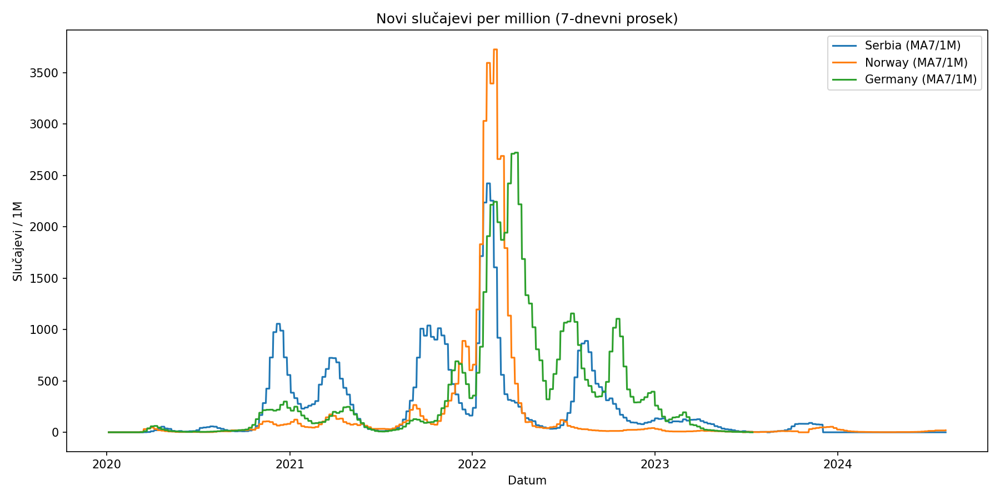
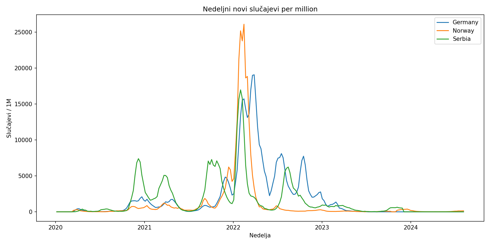
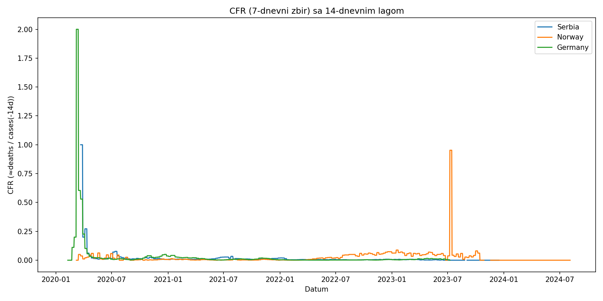
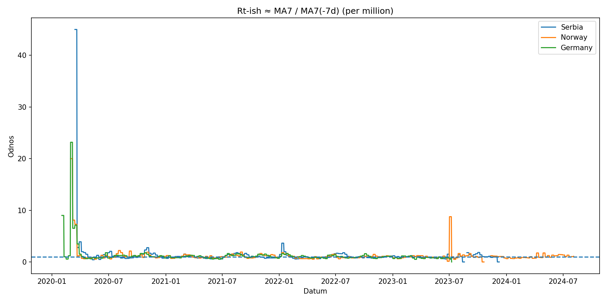

# COVID-19 Trends — Serbia, Norway, Germany (Portfolio)

A short, clean, and **reproducible** analysis of COVID-19 trends for **Serbia, Norway, and Germany**.  
Data are fetched directly from the **Our World in Data (OWID)** GitHub URL—no local file required.

> **Why this is useful:** Per-million normalization + 7-day moving average (MA7) and weekly aggregation make cross-country comparisons clearer and reduce daily noise.

---

## 🔍 What this project does
- Fetch from URL (OWID CSV) — no manual download
- Per-million normalization and MA7 smoothing — clearer trends
- Weekly aggregation (resample) — less noise
- Peaks (local maxima on MA7 per-million)
- Optional extras: CFR with lag (≈ deaths / cases(−14d)), Rt-ish (MA7 / MA7(−7d)), and lagged correlation between vaccination and deaths (+21 days)

---

## 📁 Repository structure
Minimal layout:

.
├── COVID19-Portfolio.ipynb
├── README.md
├── requirements.txt
├── .gitignore
└── outputs/
    └── plots/
        ├── new_cases_pm_ma7_compare.png
        ├── weekly_cases_pm.png
        ├── cfr_lagged.png
        └── rtish_ratio.png

## Figures

